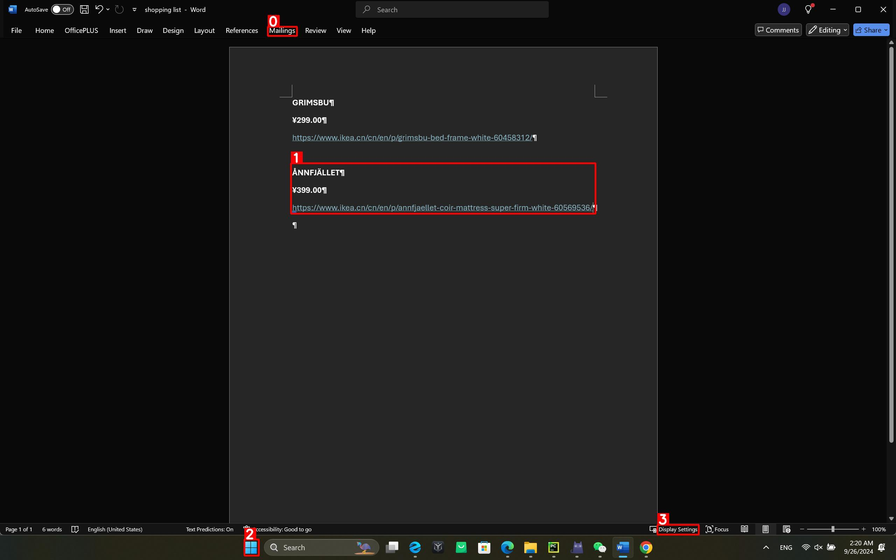

# 将咱自己数据集和模型集成在VLMEvalkit中
- 高拓展性：能对数几十个数据集/模型进行Eval。
- 使用GPT对推理后的结果进行模糊匹配

## 第1步 安装和设置必要的密钥

**安装**

```bash
git clone https://github.com/StarUniversus/Pcagent_bench.git
cd VLMEvalKit
pip install -e .
```

**设置密钥**

要使用 API 模型（如 GPT-4v, Gemini-Pro-V 等）进行推理，或使用 LLM API 作为**评判者或选择提取器**，你需要首先设置 API 密钥。如果你设置了密钥，VLMEvalKit 将使用一个评判 LLM 从输出中提取答案，否则它将使用**精确匹配模式**（在输出字符串中查找 "Yes", "No", "A", "B", "C"...）。**精确匹配模式只能应用于是或否任务和多项选择任务。**

- 你可以将所需的密钥放在 `$VLMEvalKit/.env` 中，或直接将它们设置为环境变量。如果你选择创建 `.env` 文件，其内容将如下所示：

  ```bash
  # .env 文件，将其放置在 $VLMEvalKit 下
  # 专有 VLMs 的 API 密钥
  # QwenVL APIs
  DASHSCOPE_API_KEY=
  # Gemini w. Google Cloud Backends
  GOOGLE_API_KEY=
  # OpenAI API
  OPENAI_API_KEY=
  OPENAI_API_BASE=
  # StepAI API
  STEPAI_API_KEY=
  # REKA API
  REKA_API_KEY=
  # GLMV API
  GLMV_API_KEY=
  # CongRong API
  CW_API_BASE=
  CW_API_KEY=
  # SenseChat-V API
  SENSECHAT_AK=
  SENSECHAT_SK=
  # Hunyuan-Vision API
  HUNYUAN_SECRET_KEY=
  HUNYUAN_SECRET_ID=
  # 你可以设置一个评估时代理，评估阶段产生的 API 调用将通过这个代理进行
  EVAL_PROXY=
  ```

- 如果需要使用 API 在对应键值空白处填写上你的密钥。这些 API 密钥将在进行推理和评估时自动加载。

## 第2步 评测

```bash
# 在 PcAgent_Bench(咱自己的数据) 上使用 GPT4o_20240806 进行推理和评估
python run.py --data PcAgent_Bench --model GPT4o_20240806 --verbose
# 在 PcAgent_Bench(咱自己的数据) 上使用 CorrectFLow（咱自己的模型） 进行推理和评估
python run.py --data PcAgent_Bench --model CorrectFLow --verbose

#也可以两个model放一起运行（未测试）
python run.py --data PcAgent_Bench --model CorrectFLow GPT4o_20240806 --verbose

#输出位置在./outputs
```
## 数据集示例
### 与MMBench结构类似
Here is a screenshot illustrating the task execution process, with four numbered red boxes marked. Task: ********. Which of these highlighted areas is the most appropriate for action?


